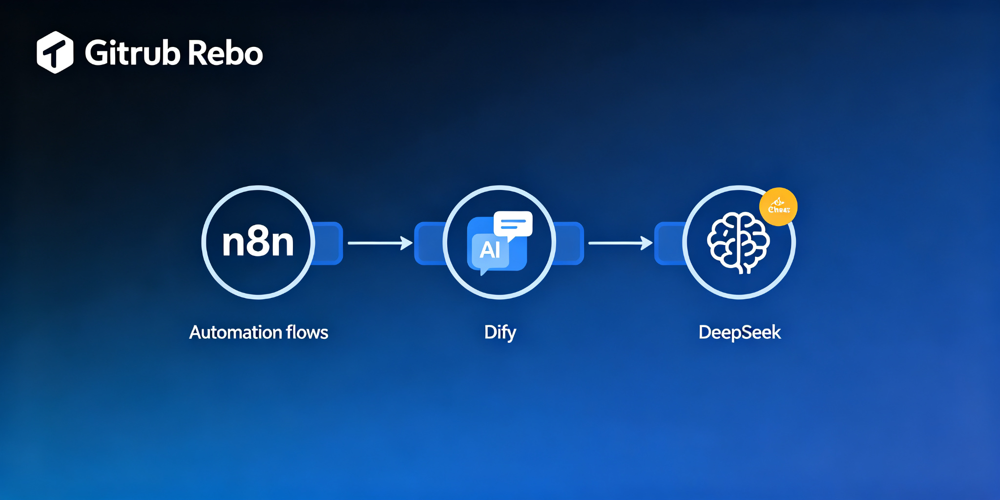

# n8n-dify-deepseek-workflow

**n8n 编排 + Dify 做 AI 应用 + DeepSeek 当便宜模型：最小闭环工作流。**

  

## 分工

| 工具 | 干什么 |
|------|--------|
| n8n | 定时任务、消息推送、跨服务串联 |
| Dify | RAG 知识库问答、对话机器人 |
| DeepSeek | 推理生成后端 |

## License

MIT
