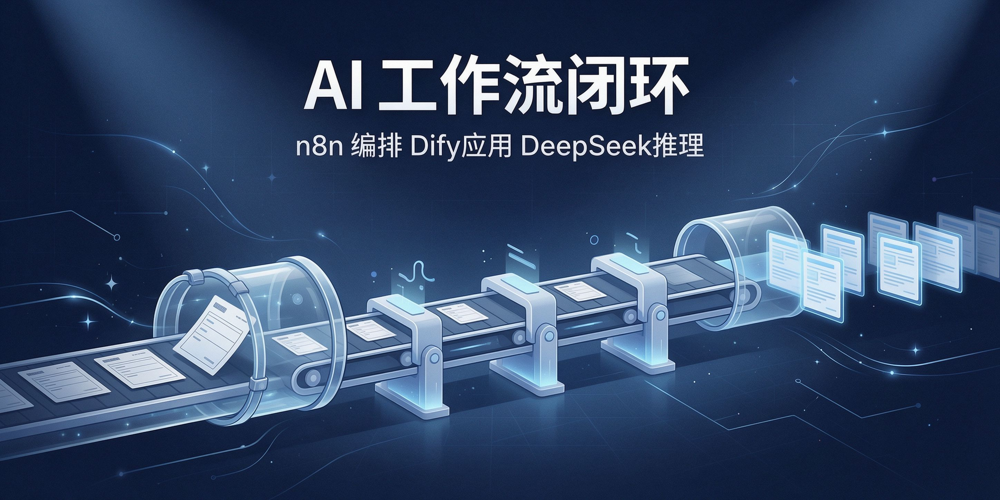

<div align="center">

# AI 工作流闭环

**n8n 编排 + Dify 应用 + DeepSeek 推理，三个容器搭最小闭环。**


[它解决什么问题](#它解决什么问题) - [为什么比手动强](#为什么比手动强) - [工作流](#工作流) - [实测参数](#实测参数) - [快速开始](#快速开始)

</div>

---

## 它解决什么问题

想搭一个能定时跑、能问答、能跨系统串联的 AI 应用，又不想上来就买重服务器、写一堆胶水代码。n8n 管自动化编排，Dify 管 RAG 问答 Bot，DeepSeek 当便宜推理后端，两个 Docker 容器起 n8n、一个 Dify，最小闭环就跑起来了。

## 为什么比手动强

| 手动硬搭 | 本仓库 |
|---|---|
| 各服务自己写 API 胶水 | n8n Webhook 互联，拖拽编排 |
| 用贵模型烧钱 | DeepSeek chat 不到 0.01 元一次 |
| 问答 Bot 从零写后端 | Dify RAG 知识库开箱即用 |
| 跨会话记忆自己存库 | Conversational Agent 接 Postgres Memory |
| 缺国内工具自己造轮子 | MCP 节点 + Call Workflow 积木扩展 |

## 工作流

```
定时触发(n8n Cron)
  → 抓取/RAG 检索
  → DeepSeek 生成答案
  → 整理入库(飞书文档/多维表格)
  → 推送企微/飞书机器人
```

## 实测参数

- **空载内存** 300-500MB；最低 1GB 内存（需加 Swap），推荐 2GB
- **成本**：`deepseek-chat` 对话/知识库问答不到 0.01 元/次；`deepseek-reasoner` 复杂推理略高
- **Agent 节点**：Conversational Agent 有上下文记忆（培训/客服），Tools Agent 无记忆（单次任务），ReAct 会自检重试
- **DeepSeek 接入**：n8n 加 ChatGPT 节点，Credential 填 API-Key + Base URL `https://api.deepseek.com`，参数与 ChatGPT 兼容

## 快速开始

```bash
# 1. 轻量部署：n8n + PostgreSQL 两个 Docker 容器，空载 300-500MB
# 2. 接 DeepSeek：n8n 搜索 ChatGPT 节点 → Credential → 填 Key + Base URL
# 3. n8n 与 Dify 用 Webhook 互调：n8n 触发 → 调 Dify API → Dify 回调 n8n
```

## License

MIT
